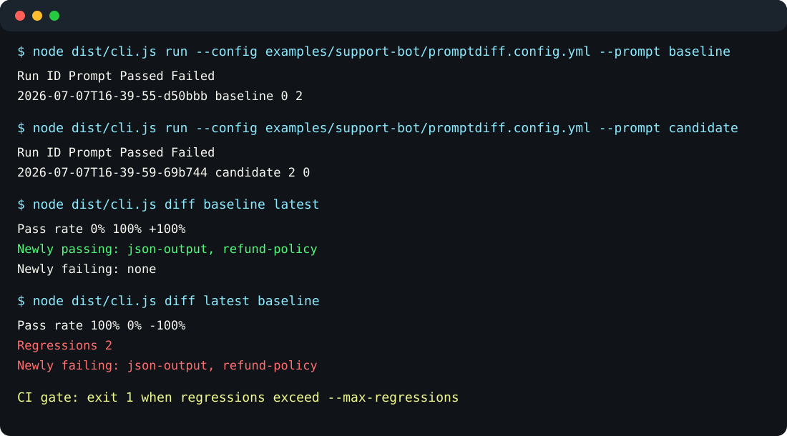

# promptdiff: Local-first regression testing and lineage for prompts

`promptdiff` is a local-first CLI for regression testing prompts. It runs prompt test cases, validates outputs with assertions like JSON Schema, stores git-friendly run artifacts, and diffs prompt versions so teams can catch regressions before shipping.



This is an MVP portfolio project. It does not claim hosted evaluation, production observability, traction, or business impact.

## Two-Minute Demo

```bash
npm install
npm run build
node dist/cli.js run --config examples/support-bot/promptdiff.config.yml --prompt baseline
node dist/cli.js run --config examples/support-bot/promptdiff.config.yml --prompt candidate
node dist/cli.js diff baseline latest
```

Expected result: the baseline fails both cases, the candidate passes both cases, and the diff shows a 0% to 100% pass-rate change with no regressions.

## Why It Exists

AI builders change prompts constantly, but prompt changes can silently break formatting, schema compliance, tone, refusal behavior, factuality, or task success. `promptdiff` keeps the first regression loop local, readable, and CI-friendly.

## What Makes It Different

- Local artifacts: runs are written to `.promptdiff/runs/*.json`.
- Git-friendly review: artifacts are plain JSON, and teams can commit selected runs when useful.
- Schema assertions early: `json_schema` is supported in the MVP, not pushed to a future hosted tier.
- CI regression gates: `diff` exits `1` when regressions exceed `--max-regressions`.
- No hosted backend: the mock provider works offline; network providers must be explicitly configured.

## Quickstart

```bash
npm install
npm test
npm run build
node dist/cli.js init
node dist/cli.js run --config examples/support-bot/promptdiff.config.yml
```

From an unpublished source checkout, the npx-style local package form is:

```bash
npx --yes --package . promptdiff run --config examples/support-bot/promptdiff.config.yml
```

To compare baseline and candidate prompts:

```bash
node dist/cli.js run --config examples/support-bot/promptdiff.config.yml --prompt baseline
node dist/cli.js run --config examples/support-bot/promptdiff.config.yml --prompt candidate
node dist/cli.js diff baseline latest
```

After the package is linked or installed, the same commands are available as `promptdiff`. Plain `npx promptdiff` is intended for a published package; before publication, use `npx --yes --package . promptdiff ...`.

## Examples

- `examples/support-bot`: refund-policy and JSON-output regression demo.
- `examples/json-classifier`: focused JSON Schema contract demo.

Each example has its own README with expected commands and output.

## Example Config

```yaml
project: support-bot-prompt-regression

prompts:
  baseline: prompts/support-v1.md
  candidate: prompts/support-v2.md

provider:
  type: mock
  model: mock-v1
  temperature: 0

cases:
  - id: refund-policy
    input: "Can I get a refund after 40 days?"
    assertions:
      - type: contains
        value: "refund"
      - type: not_contains
        value: "guaranteed"
      - type: max_length
        value: 1200

  - id: json-output
    input: "Classify this ticket: I was charged twice."
    assertions:
      - type: json_schema
        schema:
          type: object
          required: ["category", "priority"]
          properties:
            category:
              type: string
            priority:
              type: string
              enum: ["low", "medium", "high"]
```

## Example Output

```text
Run ID                           Prompt     Passed  Failed  Artifact
-------------------------------  ---------  ------  ------  -----------------------------------------------------
2026-07-07T16-39-59-094Z-69b744  candidate  2       0       .promptdiff/runs/2026-07-07T16-39-59-094Z-69b744.json
```

```text
Left:  2026-07-07T16-39-55-567Z-d50bbb
Right: 2026-07-07T16-39-59-094Z-69b744

Metric       Left  Right  Delta
-----------  ----  -----  -----
Pass rate    0%    100%   +100%
Regressions        0

Newly passing: json-output, refund-policy
Newly failing:  none
```

## Commands

```bash
promptdiff init
promptdiff run --config promptdiff.config.yml --prompt candidate
promptdiff list
promptdiff show latest
promptdiff diff previous latest --max-regressions 0
```

Exit codes:

- `0` when a command succeeds and regressions are within the configured threshold.
- `1` when `diff` finds more regressions than `--max-regressions` allows.
- `2` for config or runtime errors.

## How Artifacts Work

Every `run` writes a JSON artifact to `.promptdiff/runs/<run-id>.json`. The artifact includes:

- project name
- prompt label, path, and SHA-256 hash
- provider type, model, and temperature
- case inputs
- provider outputs
- assertion results
- timestamp and run ID

`.promptdiff/` is ignored by default because outputs may contain private prompt or user data. Teams can choose to commit selected artifacts when they want reproducible review history.

## How Diffing Works

`promptdiff diff <left> <right>` compares two run artifacts. Each reference can be:

- a run ID
- a JSON artifact path
- `latest`
- `previous`
- a prompt label such as `baseline` or `candidate`

The diff reports pass-rate change, newly passing cases, newly failing cases, assertion-level changes, and short examples of output changes.

## Assertion Types

Supported in the MVP:

- `contains`
- `not_contains`
- `regex`
- `json_schema`
- `max_length`

String assertions are case-insensitive by default. Set `case_sensitive: true` on `contains` or `not_contains` when exact casing matters.

## Provider Model

The provider interface is intentionally small:

```ts
type PromptRunInput = {
  prompt: string;
  input: string;
  variables?: Record<string, string>;
  model?: string;
  temperature?: number;
};

type PromptRunOutput = {
  text: string;
  raw?: unknown;
  usage?: {
    inputTokens?: number;
    outputTokens?: number;
    costUsd?: number;
  };
};
```

The `mock` provider is deterministic and works offline. An isolated `openai` provider exists for explicit use with `OPENAI_API_KEY`; API keys are never written to artifacts.

## CI Example

```yaml
name: promptdiff
on: [pull_request]

jobs:
  promptdiff:
    runs-on: ubuntu-latest
    steps:
      - uses: actions/checkout@v4
      - uses: actions/setup-node@v4
        with:
          node-version: 22
      - run: npm ci
      - run: npm run build
      - run: npm test
      - run: node dist/cli.js run --config examples/support-bot/promptdiff.config.yml --prompt baseline
      - run: node dist/cli.js run --config examples/support-bot/promptdiff.config.yml --prompt candidate
      - run: node dist/cli.js diff baseline latest --max-regressions 0
```

The repository includes `.github/workflows/ci.yml` with build, test, and example smoke-test coverage.

## Security And Privacy

`promptdiff` is local-first. Prompts, inputs, and outputs stay on your machine unless you explicitly configure a network provider such as `openai`. Do not put API keys in config files. Use environment variables such as `OPENAI_API_KEY`.

Run artifacts may contain sensitive inputs and outputs. Keep `.promptdiff/` ignored unless you intentionally want to review or share selected artifacts.

## Package Readiness

The public npm registry returned `E404` for `promptdiff` on 2026-07-07, with an `Unpublished on 2026-04-22T07:57:12.207Z` note. Re-check while authenticated immediately before publishing; do not treat this README as a permanent name reservation.

## Current Limitations

- No hosted dashboard.
- No database or auth.
- No semantic judge yet.
- No streaming support.
- JSON Schema assertions validate only direct JSON output text.
- The mock provider is for deterministic demos and tests, not a model-quality substitute.

## Roadmap

- LLM judge assertions with clear provenance.
- Better output diff views.
- Baseline pinning and named artifact sets.
- Provider-specific cost tracking.
- GitHub Actions examples with artifact upload.
- Optional HTML report generated from local artifacts.
