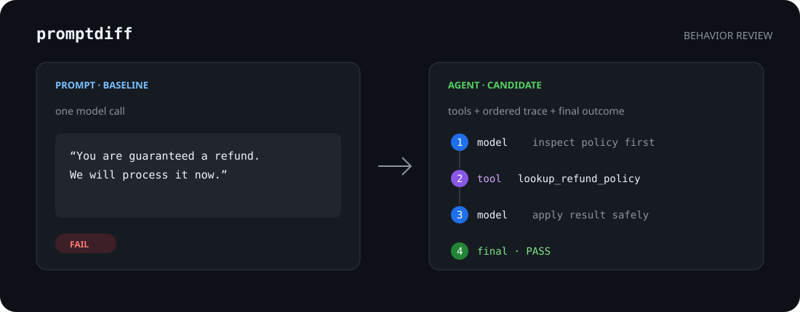

# promptdiff

[](https://github.com/LegenDairy93/promptdiff/actions/workflows/ci.yml)
[](LICENSE)
[](package.json)

**Behavioral version control and release governance for prompts and agents.**

A prompt is one model call. An agent is a program that can reason, call tools, and take several steps. Most eval output makes both look like a final string. `promptdiff` keeps the difference visible and reviews the change:



```text
prompt · baseline                 →  agent · candidate
one model response                  1. model  decide to look up policy
                                    2. tool   lookup_refund_policy
                                    3. model  apply policy to the request
                                    4. final  explain the next safe action
```

The question is not only **“did the candidate pass?”** It is **“what changed in the system's behavior, tools, trace, and outcome—and is that change safe to merge?”**

## PromptDiff vs Promptfoo

[Promptfoo](https://github.com/promptfoo/promptfoo) is a broad LLM evaluation and red-teaming platform. It tests prompts, models, RAG systems, and agents across many providers, assertions, and security probes. If you need a full evaluation or red-team platform, use Promptfoo.

PromptDiff is a focused behavioral change-control layer:

| | PromptDiff | Promptfoo |
|---|---|---|
| Primary workflow | Version and approve behavioral changes | Run evaluation matrices and red-team scans |
| Main unit | A before/after change | A target × prompt × test matrix |
| Prompt representation | One-shot source, model settings, output | Prompt/provider under evaluation |
| Agent representation | Executable target, declared tools, ordered trace, final output | Custom target or provider under evaluation |
| Review artifact | Versioned local runs, promotion history, and a self-contained HTML report | Evaluation results, dashboards, and exports |
| Intended use | Explain, approve, and gate a change before release | Measure quality, compare providers, and probe security |

This is workflow differentiation, not a claim that Promptfoo cannot test agents or detect regressions. PromptDiff owns the approval loop around a change: capture behavior, compare it, promote an accepted baseline, and gate what ships next.

## See It in Two Minutes

```bash
npm install
npm run build
node dist/cli.js run -c examples/prompt-to-agent/promptdiff.config.yml -t prompt-baseline
node dist/cli.js run -c examples/prompt-to-agent/promptdiff.config.yml -t agent-candidate
node dist/cli.js diff prompt-baseline agent-candidate
node dist/cli.js report prompt-baseline agent-candidate -o promptdiff-report.html
```

The demo is deterministic and offline. The agent is a real local command target; it reads a case as JSON and returns a final output plus an ordered trace.

## Approve and Reuse a Behavioral Baseline

A passing run is not automatically approved behavior. Promote it deliberately, record why, and compare future candidates against the named snapshot:

```bash
promptdiff promote latest --baseline production \
  --actor "reviewer@example.com" \
  --reason "Approved in PR #42"

promptdiff diff baseline:production latest
promptdiff report baseline:production latest -o promptdiff-report.html
promptdiff baselines
promptdiff history --baseline production
```

Each promotion writes an integrity-checked snapshot under `.promptdiff/baselines/` and an append-only event to `.promptdiff/history.jsonl`. New run artifacts also record PromptDiff version, portable config path, Git commit/branch/dirty state, and GitHub Actions provenance when available.

Baseline state remains local and ignored by default because artifacts may contain sensitive prompts, inputs, outputs, and traces. A shared registry and GitHub approval workflow belong to the hosted collaboration layer; v0.3 establishes the portable local contract.

## Prompt and Agent Are Different Types

```yaml
targets:
  prompt-baseline:
    kind: prompt
    file: prompt.md

  agent-candidate:
    kind: agent
    command: [node, agent.mjs]
    instructions: agent.md
    tools:
      - name: lookup_refund_policy
        effect: read              # read | write | external
        args_schema:              # every call is validated against this
          type: object
          required: [days_since_purchase]
          properties:
            days_since_purchase: { type: integer, minimum: 0 }
      - escalate_to_human         # a bare name still works
```

Declaring tools turns them from documentation into a contract. Calls to tools you did not
declare, and calls whose arguments fail `args_schema`, are recorded as **violations** on the
run. `effect` is optional and only ranks how alarming a change is: a candidate that starts
calling a `write` tool sorts above one that called `search` an extra time.

A target with **no** `tools:` opts out of tool policy entirely — nothing is flagged.

A `prompt` target runs through the configured model provider and records prompt identity, model settings, output, assertions, and usage.

An `agent` target runs your local executable and records its command, instruction identity, declared tools, ordered model/tool/final trace, output, assertions, and usage. Agent commands use a small framework-neutral JSON protocol documented in [docs/agent-protocol.md](docs/agent-protocol.md).

Legacy `prompts:` configs continue to work and are normalized to `kind: prompt`.

## What a Diff Shows

- target kind: prompt or agent
- source/instruction identity and SHA-256 hash
- model/provider or local command runtime
- declared agent tools, with effect and whether arguments are schema-checked
- pass-rate and assertion changes
- newly passing and newly failing cases
- output changes
- **tool changes**: which tools were added, removed, or called a different number of times
- **tool violations**: undeclared tools, invalid arguments, malformed trace steps
- **aligned** agent traces in the HTML report, highlighting added/removed/changed steps
- a CI verdict based on allowed regressions

Artifacts are written to `.promptdiff/runs/*.json`. They stay local and are ignored by default because prompts, inputs, outputs, and traces may contain sensitive data.

## Commands

```bash
promptdiff init
promptdiff run --config promptdiff.config.yml --target candidate
promptdiff list
promptdiff show latest
promptdiff diff previous latest --max-regressions 0
promptdiff report previous latest --output promptdiff-report.html
promptdiff promote latest --baseline production --reason "Approved in PR #42"
promptdiff baselines
promptdiff history --baseline production
promptdiff diff baseline:production latest

# opt in to gating on execution-path changes
promptdiff diff baseline candidate --gate-tool-drift
promptdiff diff baseline candidate --gate-call-deltas
```

`--prompt` remains as a deprecated alias for `--target`.

Exit codes:

- `0`: command succeeded and the regression threshold was not exceeded
- `1`: `diff` found more regressions than `--max-regressions` allows
- `2`: configuration or runtime error

## Assertions

Output assertions: `contains`, `not_contains`, `regex`, `json_schema`, `max_length`. String assertions are case-insensitive by default.

Trace assertions (agent targets — they fail loudly against a prompt target rather than passing vacuously):

| Assertion | Passes when |
|---|---|
| `tool_called` | the named tool was called, within `min_times`/`max_times`, optionally filtered by `args` |
| `tool_not_called` | the named tool was never called |
| `tool_args_match` | `any` (default) or `all` calls satisfy `args` (deep subset) or `schema` (JSON Schema) |
| `no_undeclared_tools` | nothing was called that the target did not declare, and no trace step was malformed |
| `max_steps` | the trace is within `value` steps, optionally filtered by `step_type` |

```yaml
assertions:
  - { type: no_undeclared_tools }
  - { type: tool_not_called, name: delete_records }
  - { type: tool_called, name: lookup_refund_policy, max_times: 2 }
```

## Tool changes and CI

**Identical text output does not mean identical behavior.** An agent can return the same answer
while calling a more expensive tool, reaching a new external service, using a write tool instead
of a read one, or skipping a verification step. promptdiff surfaces all of it.

It does **not** fail your build for it by default. Agent execution paths vary legitimately and are
often nondeterministic; gating every difference would create false alarms and make prompt-to-agent
comparison fail immediately — the very thing this tool exists to enable.

| Change | Default behavior |
|---|---|
| Declared tool A → declared tool B | Report, CI passes |
| Tool call count changed | Report, CI passes |
| Explicit `tool_not_called` assertion fails | **CI fails** |
| Explicit `no_undeclared_tools` assertion fails | **CI fails** |
| `--gate-tool-drift` enabled | **CI fails** on added/removed tools and new violations |
| `--gate-call-deltas` enabled | **CI fails** on call-count changes |

Enforce the invariants you actually care about with assertions; reach for the gate flags when you
want the execution path locked wholesale. Tool sections render above output changes in the diff and
are sorted by severity, so a `write`-effect tool appearing is never buried under a count change.

## CI

```yaml
- run: npm ci
- run: npm run build
- run: npm test
- run: node dist/cli.js run -c examples/prompt-to-agent/promptdiff.config.yml -t prompt-baseline
- run: node dist/cli.js run -c examples/prompt-to-agent/promptdiff.config.yml -t agent-candidate
- run: node dist/cli.js diff prompt-baseline agent-candidate --max-regressions 0
```

## Scope

This repository is an early open-source MVP. It has no hosted service, database, authentication, semantic judge, or production observability. The mock provider and example agent are deterministic fixtures for understanding the review workflow, not substitutes for model-quality evaluation.

The roadmap follows the change-control thesis: policy-as-code, deterministic replay, incident-to-regression workflows, GitHub PR annotations, and adapters for common agent runtimes and OpenTelemetry traces.

## Development

```bash
npm test
npm run build
```

Node.js 20 or newer is required. See [CONTRIBUTING.md](CONTRIBUTING.md) and [LICENSE](LICENSE).
